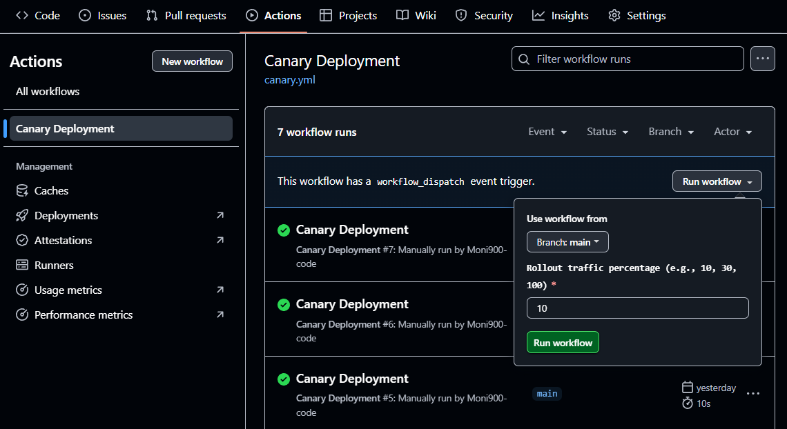
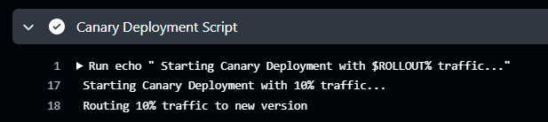
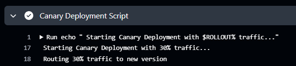
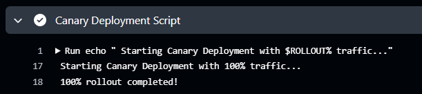

# Canary Deployment with GitHub Actions

##  What is Canary Deployment?
**Canary Deployment** is a progressive release strategy where a new version of an application is rolled out gradually to a small group of users before releasing it to the full user base.

**Let's explain it with an example,** Imagine you’re using **Facebook**. One day, you notice that the "Post" button has changed to "Share". But when you check your friend's account, their button still says "Post".

So, What’s happening here?

Here, Facebook has released a **new update**, but not for **everyone at once**. Instead, they’ve released it to just **10% of users** — and you happened to be in that group. They are now monitoring how this update performs:
- Are users comfortable with the change?
- Any bugs being reported?
- Does it affect server performance?

If everything goes well, they’ll gradually increase it to 30%, and finally 100%.
If something goes wrong, it affects only a few, and you can rollback quickly.
### This is Canary Deployment.


## Why Use Canary Deployment?
- Minimize risk by catching bugs early
- Test in production with real users
- Easy rollbacks if issues occur
- Safe for critical systems

## **Where Is Canary Deployment Used?**
- **Cloud-native apps-** Used to safely update microservices in distributed systems without full redeploy.
-  **Large-scale web platforms (e.g., Google)-** Gradually roll out features to millions of users while minimizing risk.
-  **Continuous Deployment (CD)-** Fits perfectly into automated pipelines for fast, controlled releases.
-  **Infrastructure changes-** Test updates to servers, databases, or Kubernetes clusters without affecting all users.

## When to Use It?
- Releasing a new feature
- Refactoring major code
- Updating infrastructure

### So, Canary Deployment is Safer, smarter, and highly recommended for teams that want reliability in production!
---

## 🎯 Goal

To simulate a canary deployment using **GitHub Actions** and **custom flags** (via workflow inputs) for controlling the percentage of traffic to the new version.

---
## Canary Rollout Strategy like this:

- **Phase 1:** Deploy to 10% of users
- **Phase 2:** If stable, deploy to 30%
- **Phase 3:** If still stable, deploy to 100%

You can achieve this by using:
- GitHub Actions for automation (YAML workflow files)
- Workflow input flags to simulate percentage-based releases
---

## 📁 Project Structure

```bash
Canary_Deployment-/
├── .github/
│   └── workflows/
│       └── canary.yml
└── README.md
```

## Step-by-Step Setup
- Step 1: Create Workflow Directory and canary.yml file: 

```bash
 mkdir .github/workflows
 cd .github/workflows
 touch canary.yml
```

- Step 2: using this command, write necessary content into the canary.yml file:
```bash
 nano canary.yml
```
- Step 3: Push to GitHub
  
```bash
git add .
git commit -m "Added canary deployment workflow"
git push 
```
- Step 4: Run the Workflow from GitHub
     - Go to your GitHub Repository → Actions tab
     - Select Canary Deployment workflow
     - Click Run workflow
     - Enter a percentage: 10, 30, or 100
       


- Step 5: GitHub Actions Output Example
Here’s what you’ll see in the Actions tab log output:

➤ Only 10% of the user traffic is routed to the new version of the app.


➤ Now, 30% of the traffic is moved to the new version, increasing gradually.


➤ All (100%) traffic is routed to the new version. The deployment is now fully live.


Here, Each step shows how the deployment is tested with increasing traffic using a variable ($ROLLOUT) — starting small and ending with full deployment. This is a simulation of canary deployment using custom traffic percentage inputs.

**END** of the projet........

 
